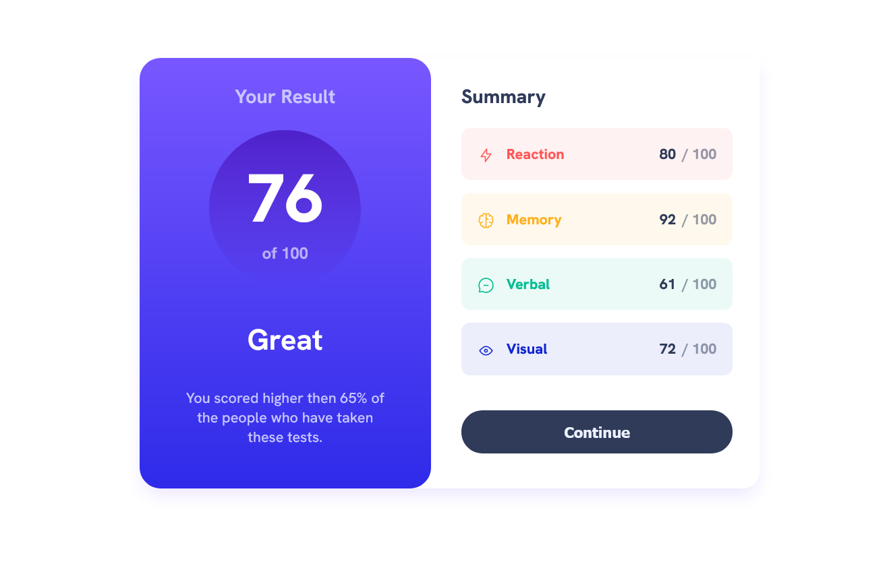
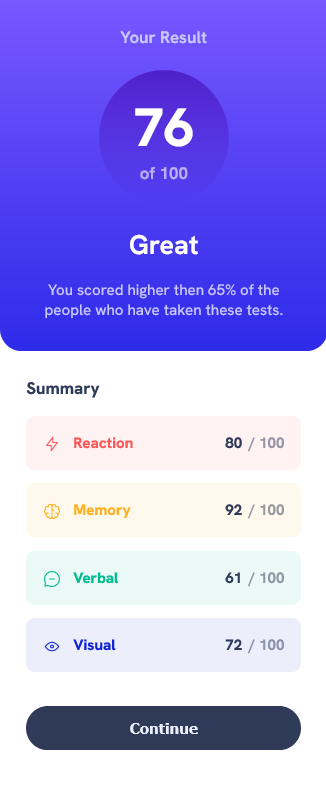

# Frontend Mentor - Results summary component solution

This is a solution to the [Results summary component challenge on Frontend Mentor](https://www.frontendmentor.io/challenges/results-summary-component-CE_K6s0maV). Frontend Mentor challenges help you improve your coding skills by building realistic projects. 

## Table of contents

- [Overview](#overview)
  - [The challenge](#the-challenge)
  - [Screenshot](#screenshot)
  - [Links](#links)
- [My process](#my-process)
  - [Built with](#built-with)
  - [What I learned](#what-i-learned)
  - [Continued development](#continued-development)
  - [Useful resources](#useful-resources)
- [Author](#author)

## Overview

### The challenge

Users should be able to:

- View the optimal layout for the interface depending on their device's screen size
- See hover and focus states for all interactive elements on the page

### Screenshot

Desktop and mobile screenshot

### Links

- Solution URL: [Github](https://github.com/viorel7774/results-summary-component-mentor-challenge)
- Live Site URL: [Add live site URL here](https://your-live-site-url.com)

## My process

### Built with

- Semantic HTML5 markup
- CSS custom properties
- Mobile-first workflow

### What I learned

I learned how to code a design. How to organized the HTML code and add the style for it.

### Continued development

I want to learn and use flexbox and css grid, to write less CSS for next projects.

### Useful resources

- [Zach Gollwitzer](https://www.youtube.com/watch?v=zwBoEwUD__0) - This helped me to learn the process of transforming a design into HTML and CSS. A 4 steps system, I really liked this system and will use it going forward.

## Author

- Frontend Mentor - [@viorel7774](https://www.frontendmentor.io/profile/viorel7774)
